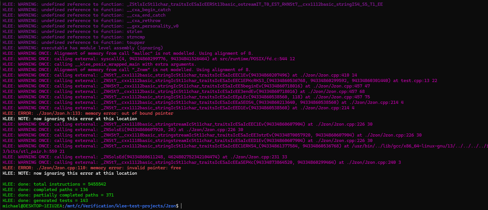

# [Jzon](https://github.com/Zguy/Jzon) is a JSON parser for C++

## Compile the test:
```
clang++-13 -I/snap/klee/10/usr/local/include -c -emit-llvm -g -O0 -Xclang -disable-O0-optnone test.cpp -o test.bc
```

## Run KLEE:
```
klee --posix-runtime --libc=uclibc test.bc
```

## Results:



## KLEE shows that Jzon has a bug at Jzon.h:133 and Jzon.cpp:110 lines

### Around Jzon.h:133 line:
```cpp
...
133     inline Type getType() const { return (data == NULL ? T_INVALID : data->type); };
...
```

### Around Jzon.cpp:110 line:
```cpp
...
108         if (data != NULL && data->release())
109         {
110             delete data;
111             data = NULL;
112         }
...
```

# Conclusion: [Jzon](https://github.com/Zguy/Jzon) **has** bugs with memory management