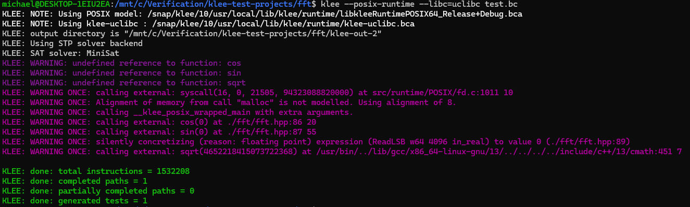

# [fft](https://github.com/wareya/fft) is a library implementing radix-2 decimation-in-time FFT

## Compile the test:
```
clang++-13 -I/snap/klee/10/usr/local/include -c -emit-llvm -g -O0 -Xclang -disable-O0-optnone test.cpp -o test.bc
```

## Run KLEE:
```
klee --posix-runtime --libc=uclibc test.bc
```

## Results:



## KLEE shows fft has no bugs

# Conclusion: [fft](https://github.com/wareya/fft) **has no** bugs which can be discovered by KLEE