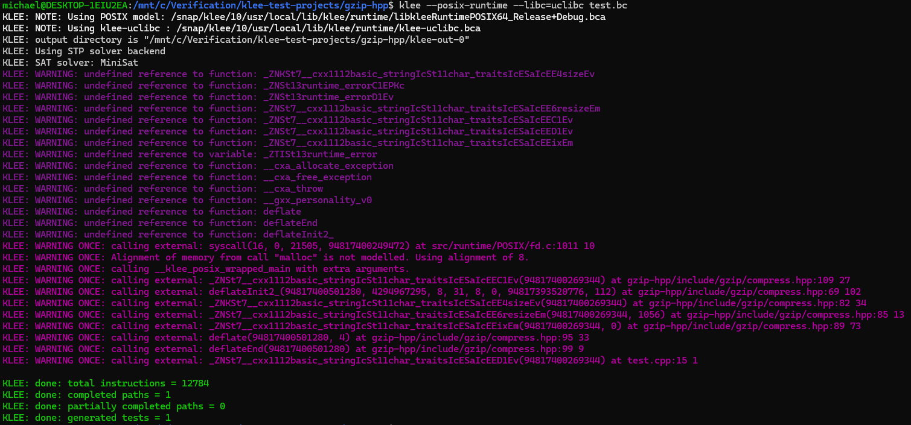

# [gzip-hpp](https://github.com/mapbox/gzip-hpp) is a library for gzip compression and decompression

## Compile the test:
```
clang++-13 -I/snap/klee/10/usr/local/include -I$(pwd)/gzip-hpp/include -c -emit-llvm -g -O0 -Xclang -disable-O0-optnone test.cpp -o test.bc
```

## Run KLEE:
```
klee --posix-runtime --libc=uclibc test.bc
```

## Results:



## KLEE shows that gzip-hpp has no bugs

# Conclusion: [gzip-hpp](https://github.com/mapbox/gzip-hpp) **has no** bugs which can be discovered by KLEE