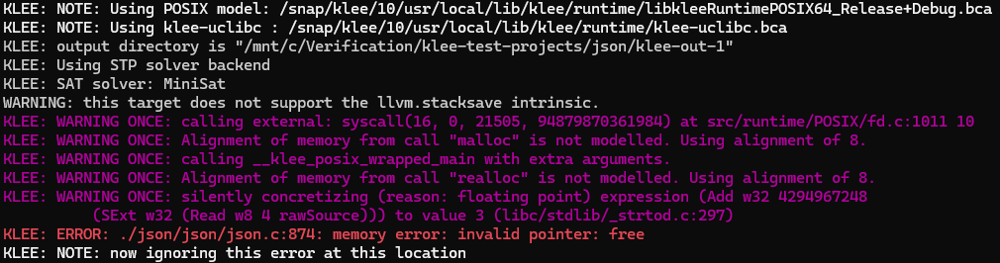

# [json](https://github.com/rpz80/json) is pure C json serialization library

## Compile the test:
```
clang-13 -I/snap/klee/10/usr/local/include -c -emit-llvm -g -O0 -Xclang -disable-O0-optnone test.c -o test.bc
```

## Run KLEE:
```
klee --posix-runtime --libc=uclibc test.bc
```

## Results:



## KLEE shows that json has a bug at json.c:874 line

### Around json.c:874 line:
```cpp
...
870     case jsonObjectT:
871         for (i = 0; i < val->u.object.len; ++i)
872         {
873             JsonVal_destroy(&val->u.object.values[i]);
874             free(val->u.object.keys[i]);
875         }
876         free(val->u.object.values);
877         free(val->u.object.keys);
878         break;
...
```


## Let's check what input has caused the problem:


## Buggy input is `"{\x01\x00\xff\xff\xff\xff\xff\xff\xff\xff\xff\xff\xff\xff\x00"`

## Check what address sanitizer says about the situation:


# Conclusion: [json](https://github.com/rpz80/json) **has** bugs with memory management