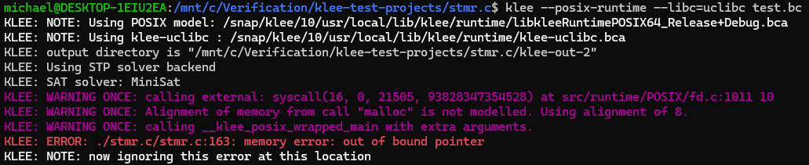
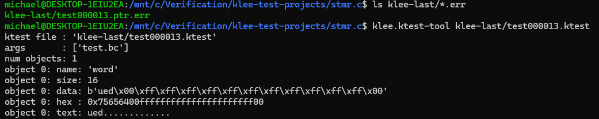
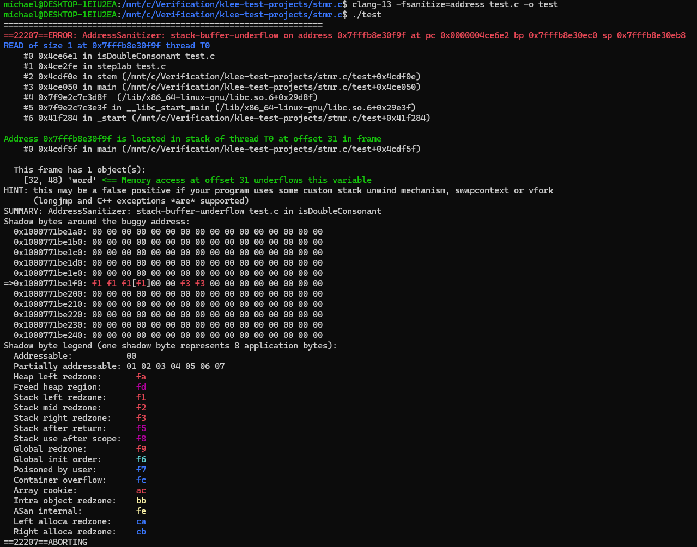

# [stmr.c](https://github.com/wooorm/stmr.c) is stemming algorithm as a C library

## Compile the test:
```
clang-13 -I/snap/klee/10/usr/local/include -c -emit-llvm -g -O0 -Xclang -disable-O0-optnone test.c -o test.bc
```

## Run KLEE:
```
klee --posix-runtime --libc=uclibc test.bc
```

## Results:



## KLEE shows that json has a bug at stmr.c:163 line

### Around stmr.c:163 line:
```cpp
...
161     static int
162     isDoubleConsonant(int index) {
163       if (b[index] != b[index - 1]) {
164         return FALSE;
165       }
166
167       return isConsonant(index);
168     }
...
```


## Let's check what input has caused the problem:


## Buggy input is `"ued\x00\xff\xff\xff\xff\xff\xff\xff\xff\xff\xff\xff\x00"`

## Check what address sanitizer says about the situation:



# Conclusion: [stmr.c](https://github.com/wooorm/stmr.c) **has** bugs with memory management