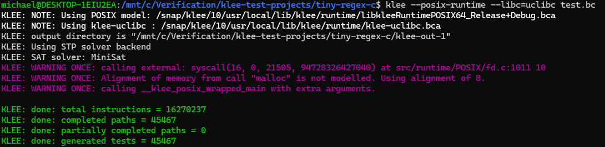

# [tiny-regex-c](https://github.com/kokke/tiny-regex-c) is a small regex implementation in C

## Compile the test:
```
clang-13 -I/snap/klee/10/usr/local/include -c -emit-llvm -g -O0 -Xclang -disable-O0-optnone test.c -o test.bc
```

## Run KLEE:
```
klee --posix-runtime --libc=uclibc test.bc
```

## Results:



## KLEE shows that tiny-regex-c has no bugs

# Conclusion: [tiny-regex-c](https://github.com/kokke/tiny-regex-c) **has no** bugs which can be discovered by KLEE