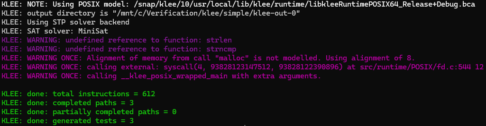

# Run
```
clang -I<klee-include-dir> -emit-llvm -c -g -O0 -Xclang -disable-O0-optnone simple.c -o simple.bc
klee --posix-runtime simple.bc
```

### Example:
```
clang-13 -I/snap/klee/10/usr/local/include -emit-llvm -c -g -O0 -Xclang -disable-O0-optnone simple.c -o simple.bc
klee --posix-runtime --libc=uclibc simple.bc
```

# Out
